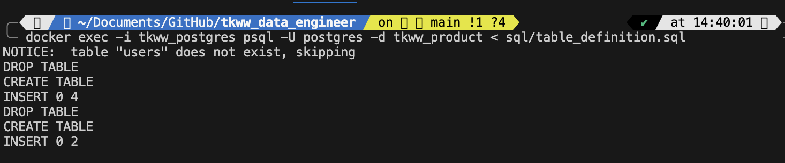
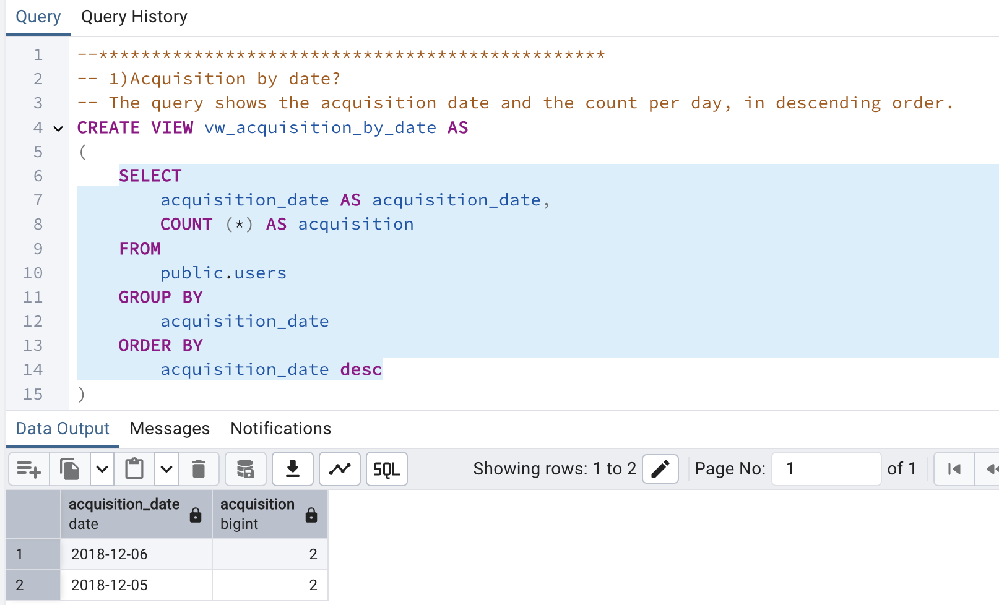
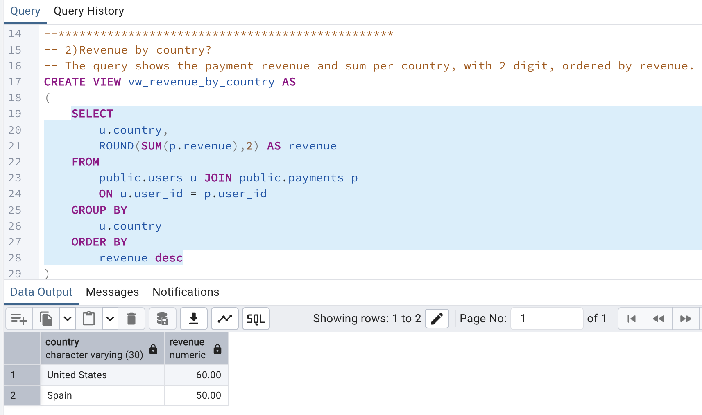
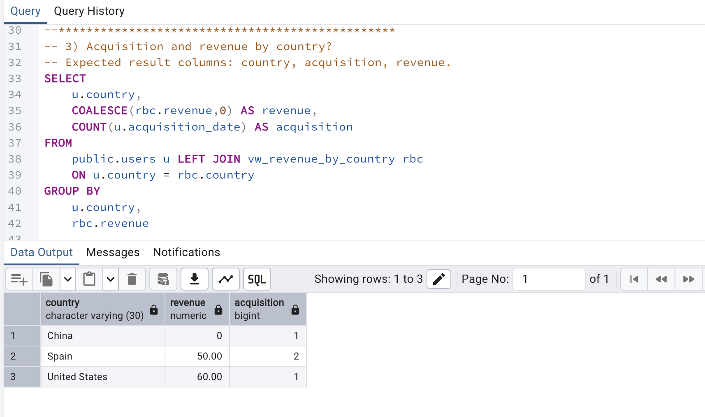
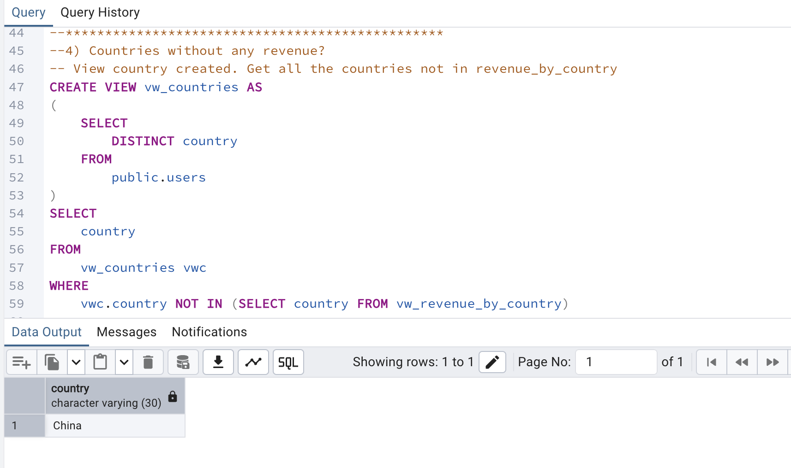
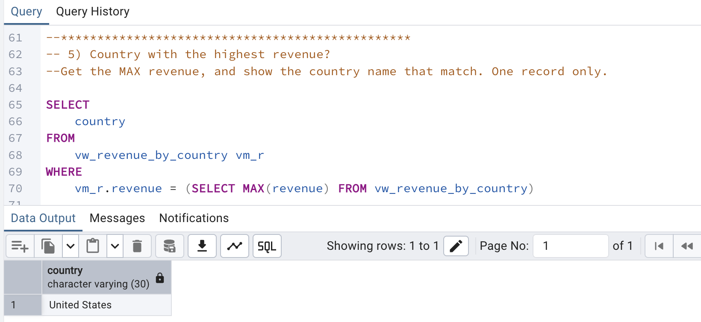
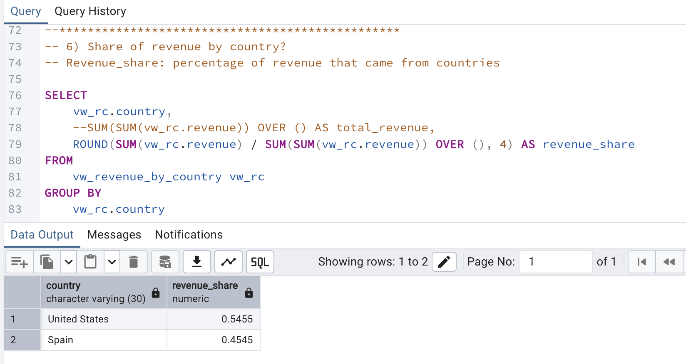
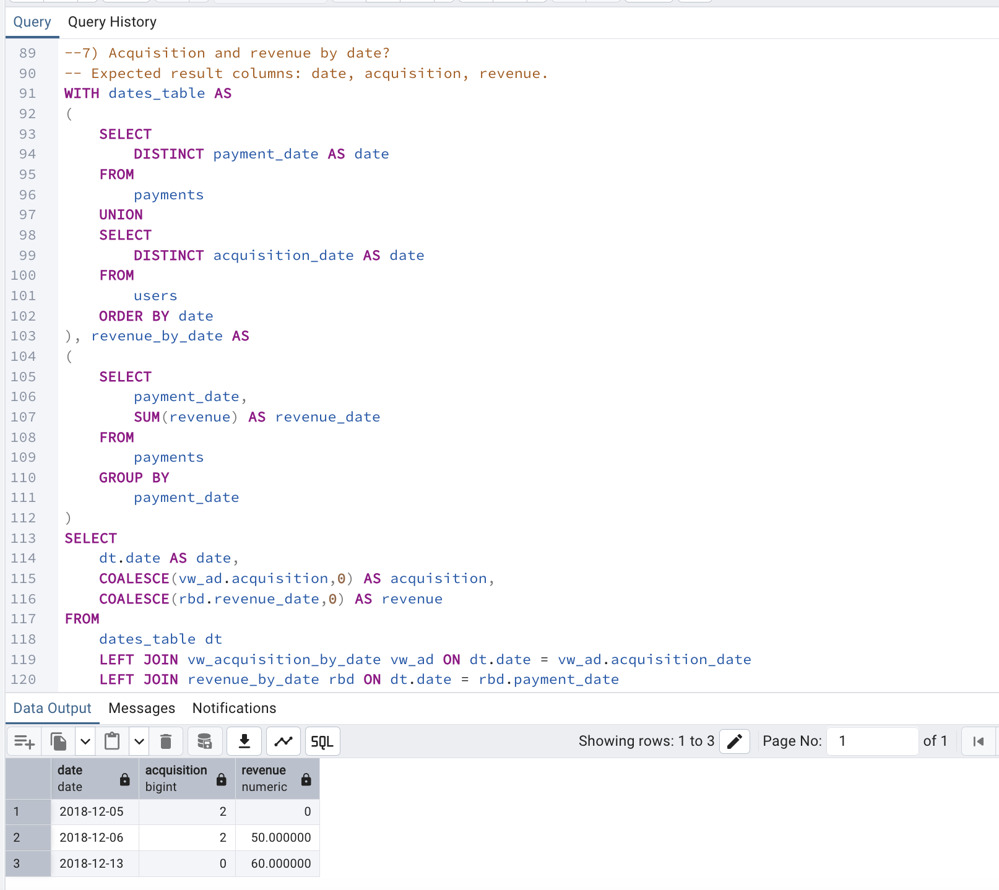
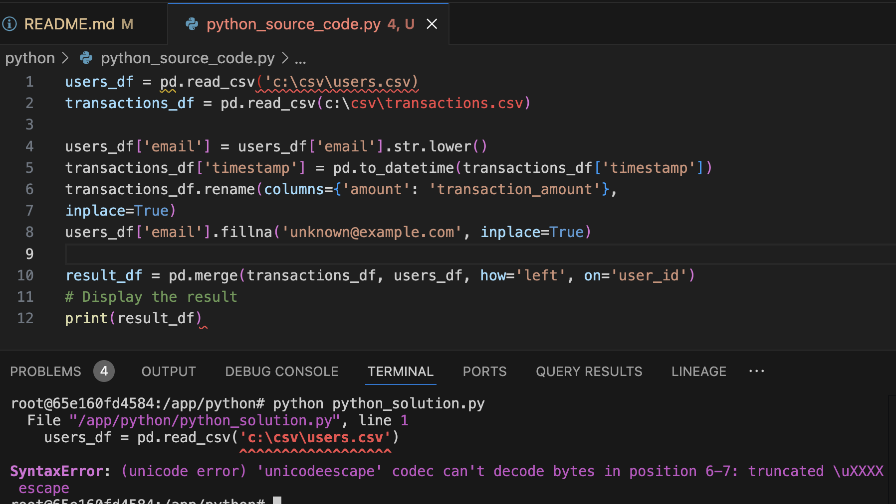
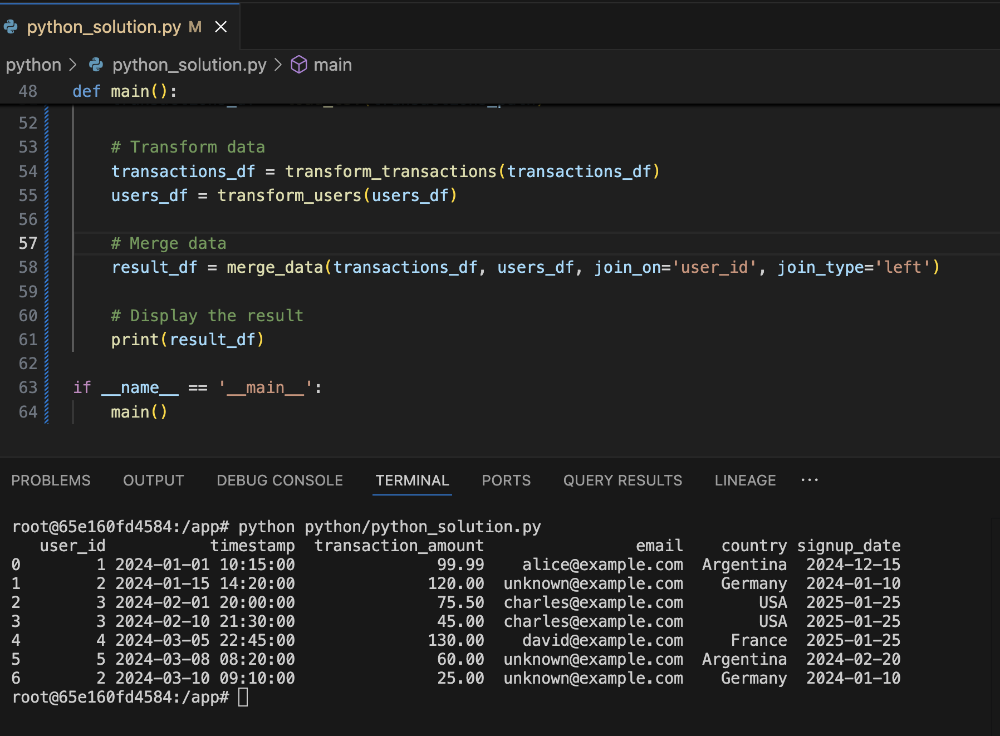

# The Knot Worldwide
### Technical challenge for data engineering position

This challenge include two basic lines: SQL and Python.

## 1) SQL Questions 

To solve the challenge I decided to use PostgreSQL (version 17) as a relational db, on a docker compose. 
Use the table_definition.sql to create and populate the tables on docker postgres.
    $ docker exec -i tkww_postgres psql -U postgres -d tkww_product < sql/table_definition.sql

After create the two required tables on a public schema (the raw data), I start to create the queries:

* **Acquisition by date?**

The query shows the acquisition date and the count per day, in descending order. In this case, I created a view with the query because I'll reuse it later.
{ width: 70%}

* **Revenue by country?**

The query shows the payment revenue and sum per country, with 2 digit, ordered by revenue. I created a view with the query because I'll reuse it later.
{ width: 70%}

* **Acquisition and revenue by country?**

The query use the view with the query from point 2, and users table. Show the revenue and aquisition per country.
{ width: 70%}

* **Countries without any revenue?**

View country created (based on distinct countries from Users table). Get all the countries not in revenue_by_country
{ width: 70%}

* **Country with the highest revenue?**

Get the MAX revenue, and show the country name that match. Return: one record only.
{ width: 70%}

* **Share of revenue by country?**

Revenue_share: percentage of revenue that came from countries. To solve it I get first the total revenue, and the revenue by country
{ width: 70%}

* **Acquisition and revenue by date?**

For this query I started creating a view with all the possible dates on users and payments tables. From here I compare this dates with the view acquisition_by_date and with CTE payments_by_date. Use COALESCE in the caswe the result is null.
{ width: 70%}

**You can find the complete soluiton in the [file here](/sql/sql_questions.sql).**

## 2) Python Questions 

This part include 3 questions:

* **What is your experience in Object Oriented Programming (OOP)?**

I’ve used OOP in a few projects. One of them was a web application I built in PHP for a doctor, where the main goal was to manage shifts. The system had different profiles: one for the doctor, one for secretaries, and one for patients. It included automatic notifications to patients about their appointments, and also allowed loading patient data and managing their medical history. I used OOP to organize the logic into classes, like handling users, appointments, notifications, and patient records.

Most recently, I’ve also developed two applications using Flask and Python. One is a fake data generator, which allows users to define a schema or fill a form to create fake datasets, then download them or save them directly to S3. The other is a mapping tool, where users can upload Excel stock files and set up mappings to match a standard format, and then the cleaned data is saved to a database. In both projects, I used OOP to structure the app logic and keep the code modular and easy to maintain.

* **Describe what the following code is doing.**

To start, this code doesn't work, has some issues. For example, the pandas library definition is missing, also some quotes.

Bue seems the main idea is:

1) Load data: Load users data and transactions data in a dataframe. The source data is in a CSV file on CSV folder.

2) Make some transformations: 
* * Set email column on users df to lower. 
* * Timestamp column is converted to datetime. 
* * Rename the amount column to transaction_amount.
* * Complete the missing emails (null value) to a default email.

3)  Merge both df: Join transaction and user dataframes using a left join (all transactions rows) on the user_id column.
Share the result in a new df.

4) Print the result df.

* **What changes would you suggest to improve it to apply SW development best practices?**

There are many suggestions we can apply to follow best practices in software development. I'll mention a few:
* Share comments: This allows you to create more readable and understandable code.
* Avoid predefined paths: If you share this script with someone who doesn't have the same path or C:/ disk name, it won't work. It's best use relative paths instead of absolute path; in this case, you can use os.path library.
* Define functions: Encapsulating multiple lines in the same module or function allows you to have a reusable and modular code. It also makes testing easier. In this case, for example, you can define functions such as load_csv (returns the dataframe and can be called twice), transform_users, transform_transactions, and merge_data.
* Define a main function: It's a good idea to have a handler function that work as an entry point to your application. This is where you can call other functions and print the results.

**You can find the proposed solution in [this script](/python/python_solution.py).**
{ width: 70%}

## EXTRA 
### Project setup

This project use a docker compose with two services: Python and postgres (for the database, and SQL questions).

**How to run it?**

1) Start the service using docker_compose file. This include start PostgreSQL and Python services, and install Python libraries from requirements.txt, 
    $docker compose -f docker/docker-compose.yml up -d

3) Run the proposed Python script with the solution: This will run my proposed solution using two CSV files with fake data to load the data frame.
    $ docker exec -it tkww_python bash
    # python python/python_solution.py

**NOTE**: Credentials saving
To protect your credentials and prevent them from being exposed to internet, you can use env variables. You should define them in the terminal and then use them instead of hardcoded credentials.
    $export DBT_USER=XXXX
    $export DBT_PASS=XXXX  

---

🙏 Thanks for your time reviewing this project! I'm happy to answer any questions or go deeper into any part of the solution.
rsradulescu@gmail.com